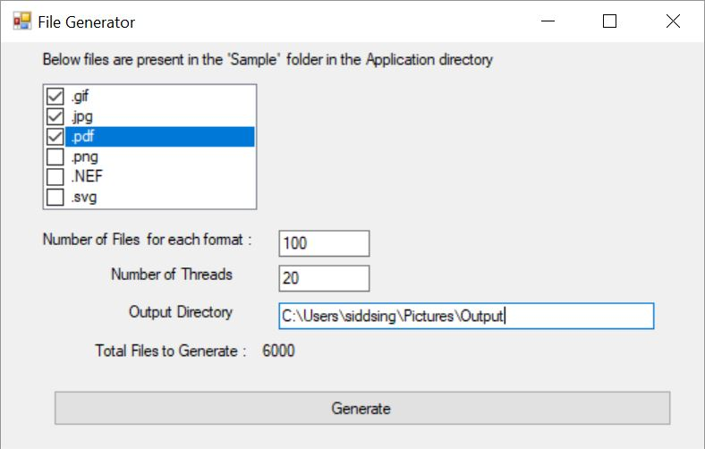

# FileCopy

A C# WinForms Application to generate Large number of different types of files using multiple Threads.

See below for Application UI-

# What's the use
While working on a Desktop File Browser Application, there was need to test the performance of the Application with different types of large number of files. The datasets needed to vary on number and type of files.

Copying the data from Network takes lots of time.

This tool can be used to quickly create the required dataset within seconds.

# How to use it
1. Clone the Repo.
2. Open the Fileopy.sln in Visual Studio 2017.
3. Build and Take the Debug\Release folder.
4. Copy the Sample Folder inside the Application directory with different types of files.

# How does it work?

1. This is a very simple application which presents a list of  type of files to select.
2. User has to provide the required number of files and number of threads. Maximum value allowed in this code is 10000 for files and 30 for threads.
3. The application takes the sample files and starts multiple threads for each file format- generating new files (Guid based names) by Copying the sample files.
4. Once All threads are finish, it shows the successful completion message and total time taken in the operation.

After a certain number of threads and files, it's all dependent on the I/O speed and increasing the number of threads does not help much. If we increase it to maximum, the CPI and Disk will become at 100% and slows down the machine. Definitly, SSDs perform better here.

# License
The code is licensed under MIT license.
